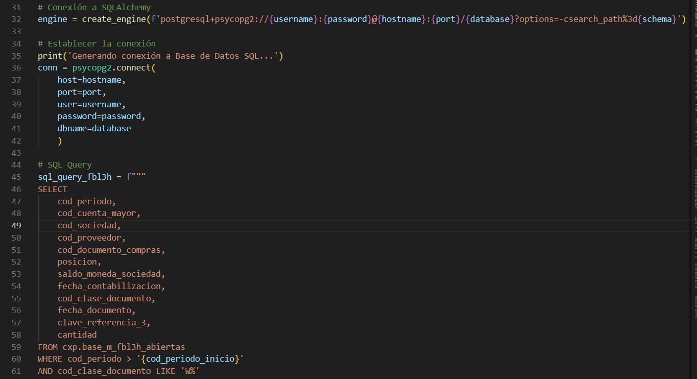
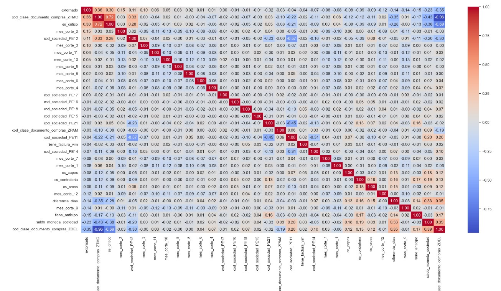

# Modelo de Aprendizaje Automático: Identificación de Partidas Abiertas Vencidas para Ajuste

### Objetivo

- Se busca **identificar las partidas abiertas vencidas al cierre del periodo que deben ser ajustadas contablemente**
- Por tanto, el presente modelo es de **clasificación binaria**. Solo se busca identificar si la partida debe ser marcada para ajuste (1) o no (0)
- Se toma como base del análisis, los extornos generados por el equipo de AP en los últimos 2 años, para **identificar una posible estacionalidad**. Luego se correrá el modelo sobre el último periodo disponible, en este caso setiembre 2024, el cual no se va a utilizar para el entrenamiento, sino para las predicciones.
- Se busca minimizar el impacto de **falsos positivos**: Ajustar partidas que no corresponden
- Debido a esto último, mediremos este proceso utilizando la métrica de **Precisión (Precision)**. No obtante, se tomarán en cuenta otras métricas para identificar posibles sobreajustes del modelo

# Extracción de Data

Aquí también tengo el ejemplo de un query que utilizo de mis reportes que fueron extraidos previamentes de SAP.

# Descripción del Dataset

Aquí algunos datos del Dataset inicial

**Conclusiones**

- El dataset de prueba cuenta con 19 variables y 31106 registros
- Se cuenta con 9 columnas numéricas y 10 columnas categóricas del tipo nominal
- Además, se cuenta con información del periodo Agosto 2022 hasta Setiembre 2024. 24 meses anteriores al último periodo.
- Para el Dataset de prueba, solo se va a tomar hasta el periodo Agosto 2024.
- Una orden de compra puede aparecer en más de un periodo, debido a que se mide todo lo pendiente al cierre de cada periodo.
- Tomando esto en consideración, no se cuentan con duplicados por Orden de Compra, Posición y Periodo
- Tenemos datos faltantes en la columna indicador_cme y cod_imputacion
- Se puede apreciar que más del 75% de los datos de saldo_moneda_sociedad está por debajo de las 3985.26 unidades monetarias, cuando el máximo es de 2273750.00 unidades monetarias, lo que indica **presencia de outliers**.
- En el caso de lo extornado y los pendientes_vim, más del 75% de los datos son 0, lo que habla de un **desbalance de datos en estas variables**

# Análisis Exploratorio de Datos (EDA)

## Análisis Univariado

## Análisis Bivariado

## Matriz de Correlación

De acuerdo a la matriz de correlación, podemos concluir lo siguiente.

- Es mucho más probable que se extorne una partida de exportaciones (que tiene una correlación de 0.36) que una partida de Servicios (con una correlación negativa de -0.35)
- La criticidad del proveedor no suele ser relevante para extornar partidas de exportaciones, lo que se ve reflejado en su correlación fuerte con la clase de documento ZTMC (0.72)
- Es más probable que el mes 2 (febrero) se terminen extornando partidas, a diferencia del mes 12.
- A mayor importe en moneda sociedad, menos probable es que se extorne (según la correlación negativa de -0.23)
- Si la partida es de Capex, Cross o Contraloría, es menos probable que se extorne.
- Las sociedades no suelen tener impacto relevante en la decisión de extornar una partida.

