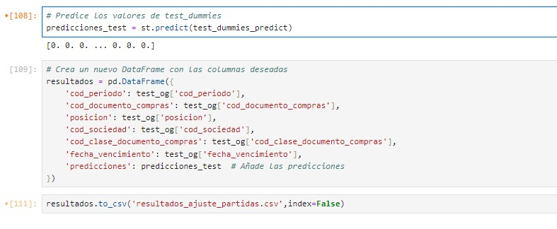

# Modelo de Aprendizaje Automático: Identificación de Partidas Abiertas Vencidas para Ajuste

### Objetivo

- Se busca **identificar las partidas abiertas vencidas al cierre del periodo que deben ser ajustadas contablemente**
- Por tanto, el presente modelo es de **clasificación binaria**. Solo se busca identificar si la partida debe ser marcada para ajuste (1) o no (0)
- Se toma como base del análisis, los extornos generados por el equipo de AP en los últimos 2 años, para **identificar una posible estacionalidad**. Luego se correrá el modelo sobre el último periodo disponible, en este caso setiembre 2024, el cual no se va a utilizar para el entrenamiento, sino para las predicciones.
- Se busca minimizar el impacto de **falsos positivos**: Ajustar partidas que no corresponden
- Debido a esto último, mediremos este proceso utilizando la métrica de **Precisión (Precision)**. No obtante, se tomarán en cuenta otras métricas para identificar posibles sobreajustes del modelo

# Extracción de Data

Aquí también tengo el ejemplo de un query que utilizo de mis reportes que fueron extraidos previamentes de SAP.


# Descripción del Dataset


**Conclusiones**

- El dataset de prueba cuenta con 19 variables y 31106 registros
- Se cuenta con 9 columnas numéricas y 10 columnas categóricas del tipo nominal
- Además, se cuenta con información del periodo Agosto 2022 hasta Setiembre 2024. 24 meses anteriores al último periodo.
- Para el Dataset de prueba, solo se va a tomar hasta el periodo Agosto 2024.
- Una orden de compra puede aparecer en más de un periodo, debido a que se mide todo lo pendiente al cierre de cada periodo.
- Tomando esto en consideración, no se cuentan con duplicados por Orden de Compra, Posición y Periodo
- Tenemos datos faltantes en la columna indicador_cme y cod_imputacion
- Se puede apreciar que más del 75% de los datos de saldo_moneda_sociedad está por debajo de las 3985.26 unidades monetarias, cuando el máximo es de 2273750.00 unidades monetarias, lo que indica **presencia de outliers**.
- En el caso de lo extornado y los pendientes_vim, más del 75% de los datos son 0, lo que habla de un **desbalance de datos en estas variables**

# Análisis Exploratorio de Datos (EDA)

## Análisis Univariado

Para este caso, voy a mostrar únicamente dos variables de las 11 que estoy utilizando para este modelo.

### Variable Objetivo - Extornado


Podemos apreciar en este análisis que nuestra variable objetivo presenta un significativo nivel de desbalance. Se recomienda aplicar alguna de las técnicas de balanceo de datos para mejorar la precisión del modelo.

### Variable Mes Corte


Vemos que, en cuanto a la estacionalidad de los últimos 12 meses, la mayoría de partidas abiertas se han dado en los meses de setiembre y octubre. 

Además, podemos apreciar que los meses con más partidas abiertas le corresponden al segundo semestre en su mayoría (9, 10, 11, 12). Esto se puede explicar debido al aumento de volumetría que se dan para las campañas a fin de año.

## Análisis Bivariado

De la misma manera, solo voy a tomar un par de variables y su relación con mi variable objetivo. Es en el análisis bivariado donde se pueden detectar ciertos patrones que permanecen ocultos a simple vista, o bien pueden confirmar algunos supuestos.

### Clase Documento Compras


Las ordenes de compras que más se extornan son las de ZTMC. Además, vemos que, a pesar de que ZPAM sea solo el 4% del total, se extorna más en proporción que el ZDEL, que representa el 67% del total.

### Variable Mes Corte


Vemos que hay una disminución de extornos en los meses de diciembre y enero. Esto debido a que se prefiere evitar extornar partidas en estos meses. 

Usualmente, estos extornos terminan regularizándose a partir de febrero en adelante.

## Matriz de Correlación


De acuerdo a la matriz de correlación, podemos concluir lo siguiente.

- Es mucho más probable que se extorne una partida de exportaciones (que tiene una correlación de 0.36) que una partida de Servicios (con una correlación negativa de -0.35)
- La criticidad del proveedor no suele ser relevante para extornar partidas de exportaciones, lo que se ve reflejado en su correlación fuerte con la clase de documento ZTMC (0.72)
- Es más probable que el mes 2 (febrero) se terminen extornando partidas, a diferencia del mes 12.
- A mayor importe en moneda sociedad, menos probable es que se extorne (según la correlación negativa de -0.23)
- Si la partida es de Capex, Cross o Contraloría, es menos probable que se extorne.
- Las sociedades no suelen tener impacto relevante en la decisión de extornar una partida.

# Tratamiento de Outliers

En esta parte del análisis, revisamos si hay outliers dentro de las variables numéricas que consideramos relevantes.

- saldo_moneda_sociedad
- diferencia_dias

```python
def tratar_outliers(df,col):

    Q1=df[col].quantile(0.25) # 25th quantile
    Q3=df[col].quantile(0.75)  # 75th quantile
    IQR=Q3-Q1

    # Para este métrica vamos a utilizar el 1.5 del Rango Intercuartil
    Lower_Whisker = Q1 - 1.5*IQR
    Upper_Whisker = Q3 + 1.5*IQR
    df[col] = np.clip(df[col], Lower_Whisker, Upper_Whisker)

    return df

```

Por ejemplo, para la variable de saldo_moneda_sociedad, se aplicó la función mostrada y en el boxplot resultante se puede ver que no aparecen outliers.


# Tratamiento del Desbalance de Datos

Antes de entrenar el modelo, tenemos que mapear el tema del desbalance de datos de nuestra variable objetivo. Para evitar la pérdida de datos, vamos a probar la técnica de **sobremuestreo (oversampling)**.

Cabe mencionar que también corrí el modelo con submuestreo o undersampling, pero mi performance cayó, por lo que al final me quedé con el sobremuestreo.


# Entrenamiento de los Modelos

Para este análisis, he probado con 11 modelos, pero mostraré la matriz de confusión de dos (Decision Tree y Random Forest)

### Decision Tree


### Random Forest


## Comparación de los mejores modelos

### Comparación de Métricas por Precision Test


En la comparación de todos los modelos basados en la Precisión, se ve que el mejor modelo es el **Stacking Classifier**, seguido del **Random Forest**

### AUC - Área Bajo la Curva


El resultado de nuestra evaluación AUC es de **0.98**, lo que indica una excelente capacidad del modelo para distinguir entre clases positivas y negativas.

- Un valor de 1 significa que el modelo clasifica perfectamente ambas clases.
- Un valor de 0.5 indica que el modelo no tiene capacidad de discriminación y actúa como si fuera al azar, como lanzar una moneda.
- Un valor inferior a 0.5 indica que el modelo clasifica peor que al azar, confundiendo más de lo que acierta.

### Mejores Estimadores del Mejor Modelo

Para este caso en particular, vamos a tomar el Random Forest, el cual es el mejor modelo por debajo del Stacking Classifier.

No tomamos este último debido a que no se pueden identificar el peso de los estimadores de este modelo en particular.


Se puede apreciar que el estimador más importante para el Random Forest es la diferencia de días. A mayor cantidad de días, es más probable que una partida se ajuste. 

# Predicción con Data de Prueba

Finalmente, usamos nuestra data de Test, que es un dataframe sobre el cual haremos las predicciones y eso será mi propuesta de ajuste para partidas vencidas del periodo Setiembre 2024.



Con las predicciones exportadas en csv, se puede dar por concluido este proceso de Machine Learning
