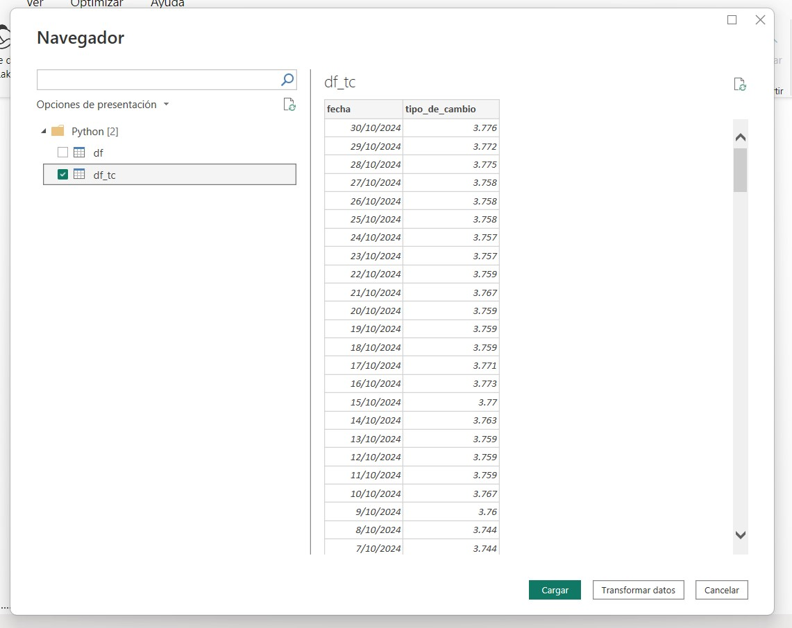

# Extraer una tabla de Internet con Python y subirla a Power BI

Una de las necesidades que surgieron fue la de tener una tabla con el Tipo de Cambio actualizado a la fecha. Sin embargo, no quería tener que descargar la tabla todos los días para poder actualizar mi Dashboard. 

Si bien no es una actividad particularmente complicada, el depender de un archivo plano para la actualización es algo que trato de evitar en la medida de lo posible.

Por lo mismo, aquí les muestro cómo hice para poder hacer una conexión directa con la página, modelando el archivo con Python y cargándolo a Power BI.

**¿Por qué no usar el origen de datos de Power BI de Web?** En este caso es porque hay algunas transformaciones que son mucho más fácil de hacer con Python, las cuales mostraré a continuación.

## Contenido
1. Identificar la página
2. Scraping con Python usando Requests
3. Importación del DataFrame a Power BI

## 1. Identificar la página

Lo que podemos apreciar de la página, y de su URL, es que es una página con contenido HTML. Por tanto, esperamos que la respuesta de nuestro requests sea un html. 

Además, necesitaremos de la librería BeautifulSoup para poder leerlo de manera apropiada.


## 2. Scraping con Python usando Requests

Para este scraping sencillo, solo vamos a necesitar las siguientes librerías.

```python
import requests
from bs4 import BeautifulSoup
import pandas as pd 
```

Primero, trataremos de extraer la tabla con la fecha y el tipo de cambio. Para este paso es necesario hacer un análisis sobre la respuesta que nos arroja requestas para identificar correctamente las características de la tabla que estamos buscando.

```python
url = 'https://estadisticas.bcrp.gob.pe/estadisticas/series/diarias/resultados/PD04640PD/html'

# Extraemos lo que hay en la página y, como la respuesta es un html,
# Usamos BeautifulSoup para poder leerlo correctamente
respuesta = requests.get(url)
soup = BeautifulSoup(respuesta.text, 'html.parser')
# Usamos la función find_all para extraer la tabla
filas = soup.find_all('tr')
```

Ahora, iteramos sobre cada fila de la tabla y cada resultado lo vamos añadiendo a un par de listas que usaremos para generar el dataframe.

```python
# Aquí crearé un par de listas para almacenar los valores
fechas = []
valores = []

# Recorro cada fila de la tabla Soup y los valores los guardo en las listas
for fila in filas:
    fecha = fila.find('td', class_='periodo')
    valor = fila.find('td', class_='dato')
    
    if fecha and valor:
        # Por si acaso, quitamos espacios en blanco
        fechas.append(fecha.text.strip())
        valores.append(valor.text.strip())
```

Una vez que ya tenemos la lista, creamos el DataFrame con Pandas.

```python
# Genero un diccionario para poder crear el dataframe
dict_tc = {
    'fecha':fechas,
    'tipo_de_cambio':valores
}

df = pd.DataFrame(dict_tc)
```

Fue en este paso que tuve que realizar diversas transformaciones debido a que:
- El formato de fecha está de esta manera "24Oct97", el cual no es fácil de interpretar para Python
- Hay algunas filas duplicadas en mi tabla.
- No están todos los días. Se asume que, si el TC de una fecha no está publicado, se usa el del día inmediato anterior.

### 1.1. Tratamiento de Fechas

En este punto, trato de transformar las fechas a un formato reconocible para Python.

```python
# Ahora, el problema es que las fechas las guarda con un formato 24Oct97, por lo que haré unas transformaciones adicionales
dict_mes = {
    'Ene':'-01-',
    'Feb':'-02-',
    'Mar':'-03-',
    'Abr':'-04-',
    'May':'-05-',
    'Jun':'-06-',
    'Jul':'-07-',
    'Ago':'-08-',
    'Set':'-09-',
    'Oct':'-10-',
    'Nov':'-11-',
    'Dic':'-12-'
}

# Reemplazar los meses por los valores del diccionario
for key, value in dict_mes.items():
    df['fecha'] = df['fecha'].str.replace(key, value)
```

### 1.2. Remover Duplicados

Haciendo un mapeo general de la tabla, esta tiene algunos días duplicados, por lo que es necesario tratarlos para poder seguir avanzando.

```python
# He detectado que en mi tabla hay duplicados, pero el importe es el mismo,
# Así que usaré Drop Duplicates sin perder datos adicionales
df = df.drop_duplicates(subset='fecha')

# Ahora que ya tengo mis fechas en un formato estandarizado. Ejm: 01-01-97, la convierto a datetime
df['fecha'] = pd.to_datetime(df['fecha'],format='%d-%m-%y')

# Para continuar, necesito establecer la columna fecha como índice
df.set_index('fecha', inplace=True)
```

### 1.3. Tratamiento de Fechas Faltantes

Finalmente, el último problema que encontré con esta tabla es que no tiene todos los días. Para otro caso en particular que estoy trabajando, sí necesito todas las fechas porque necesito establecer una relación con otra tabla que puede tener días calendario.

Por lo tanto, necesito generar esas fechas faltantes basado en el rango de la primera y última fecha disponible.

```python
# Ahora tengo un problema:
# No tengo todos los días debido a que solo se toman en cuenta los días hábiles, 
# sin embargo, me gustaría tener el rango completo de fechas, sean hábiles o no

# Aquí creamos un rango de fechas que cubra el rango completo de fechas del DataFrame por día
rango_fechas = pd.date_range(start=df.index.min(), # primer día
                             end=df.index.max(), # ultimo día
                             freq='D' # Frecuencia: Días
                             )

# Reindexamos nuestro dataframe original con este cambio de fechas
df_tc = df.reindex(rango_fechas)
```

Las fechas no publicadas (que están como "n.d") necesito que estén como valor nulo para poder usar la función ffill(), el cual rellenará los nulos con el último valor no-nulo anterior.

```python
# Por normativa, cuando no se publica el TC, se debe utilizar el del día inmediato anterior
# Por lo que ahora rellenamos los valores con el último valor conocido
df_tc['tipo_de_cambio'] = df_tc['tipo_de_cambio'].replace('n.d.',pd.NA).ffill()

# Al momento de reindexar, nuestra columna pierde el nombre, por lo que le volveremos a agregar "Fecha" como cabecera
df_tc.reset_index(inplace=True)
df_tc.rename(columns={'index': 'fecha'}, inplace=True)

# Ordenamos de manera descendente
df_tc = df_tc.sort_index(ascending=False)
```

Y, al final, este fue el resultado de mi transformación: Un DataFrame con el día y el TC actualizado a la fecha más reciente disponible.


## 3. Importación del DataFrame a Power BI

Una vez que tenemos el script terminado y funcionando, vamos a Power BI y en orígenes de datos, seleccionamos la opción que dice: "Script de Python"


Luego, se nos va a habilitar una ventana en la que podemos copiar el código que hagamos. Cabe mencionar que esta opción está limitada a scripts que generen DataFrames. No podemos subir scripts que automaticen acciones o que interactuen con archivos de manera dinámica.


A continuación, seleccionamos el DataFrame generado de nuestro interés. Según lo mostrado anteriormente, el DataFrame final es **df_tc**, por lo que será ese el que vamos a cargar.



Finalmente, cuando ya tenemos el dataframe cargado, ya podremos usarlo para hacer gráficas, relaciones con otras tablas, etc. Este es un ejemplo de una gráfica del evolutivo del tipo de cambio de la SBS.


Espero que les haya servido. Aquí un link al código completo: 
